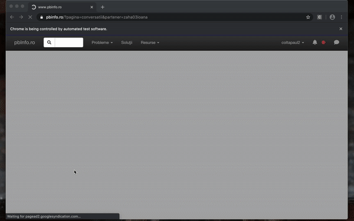

# pbinfo_bot

Chat bot to send messages to users - https://www.pbinfo.ro/

Tested on MacOS:

1. Install selenium

```pip install selenium```

2. Install webdriver manager

```pip install webdriver_manager```

3. Install Chrome webdriver

```brew cask install chromedriver```


There are 2 different bot implementations:

1. Send messages to the last active users.
2. Send messages to the users by problem.



